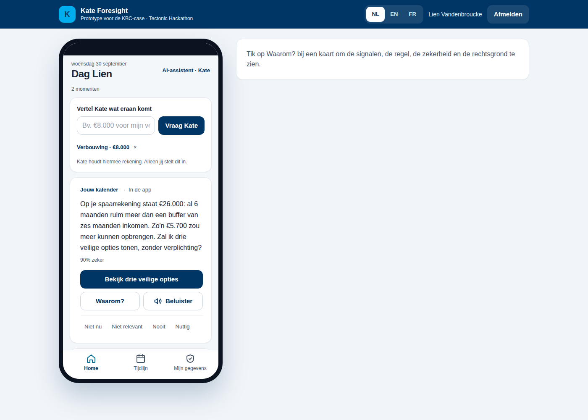
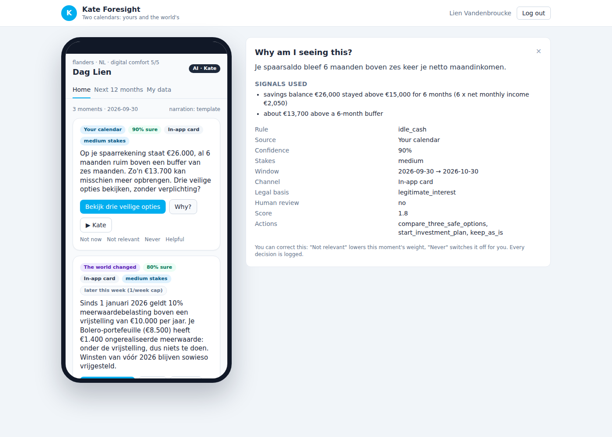
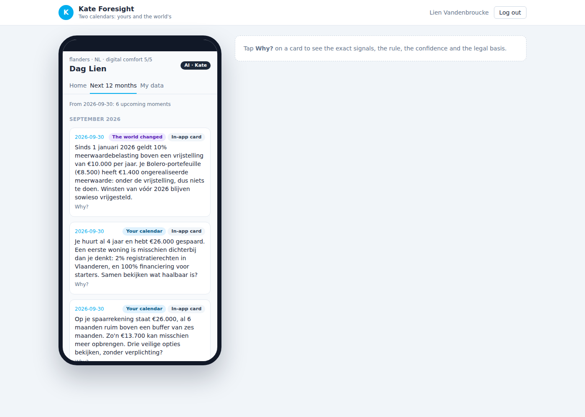
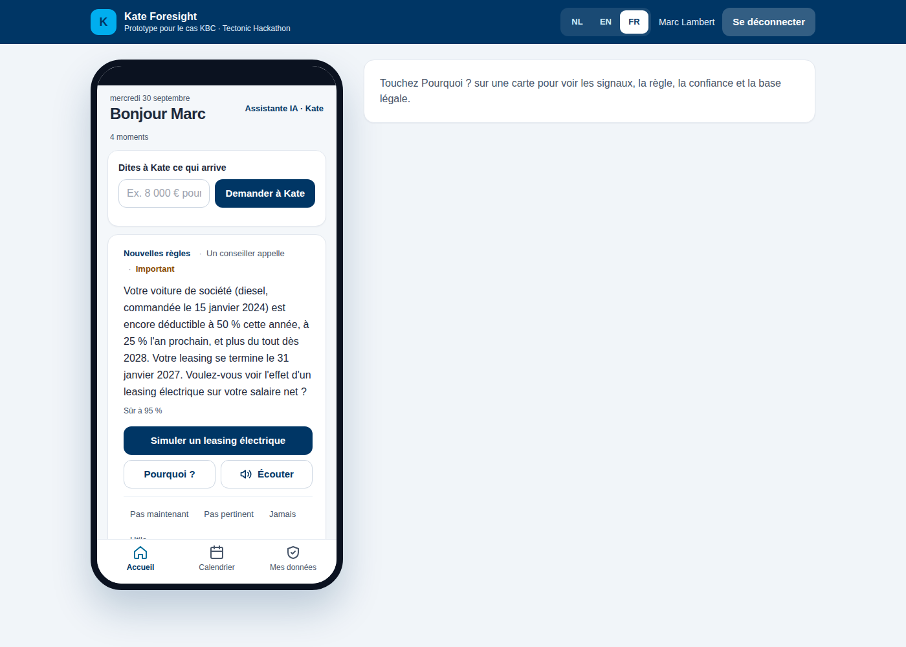
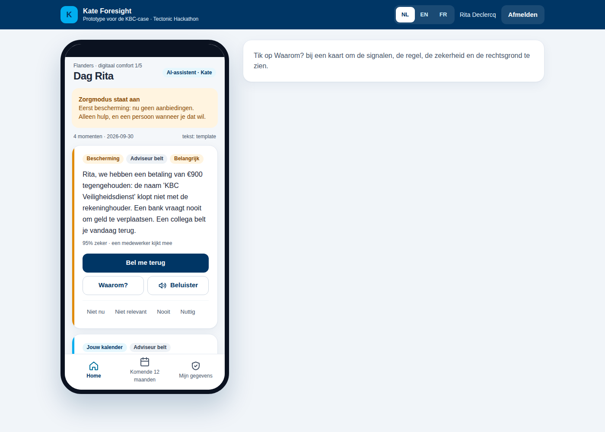
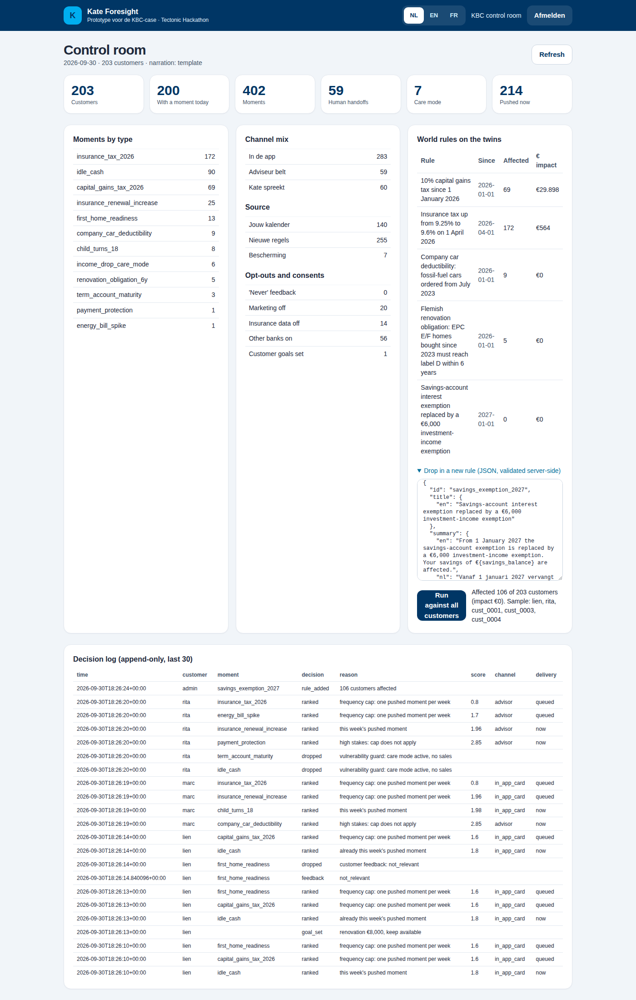

# Kate Foresight

**Team 404 Brain Not Found · Tectonic Hackathon 2026 · KBC case**

Belgian financial life runs on two calendars: your own (salary, holiday pay in May, the year-end bonus, insurance renewals, a lease ending, a child turning 18) and Belgium's (tax deadlines, new rules such as the 2026 capital-gains tax). KBC is a bank and an insurer, so it already holds both. Kate Foresight is a decision layer that reads both calendars for every customer, predicts the money moments that are about to happen, and delivers the right help at the right moment through the right channel: an in-app card, a Kate voice note, or a human advisor. Every message shows why it appears, and the customer can correct it. This repo is a working proof of concept: a rule engine, an arbitration engine, a customer app in NL/EN/FR, and a control room over 203 synthetic customers.

## The problem KBC asked

> "Imagine a future where KBC perfectly understands what customers need and responds at exactly the right moment... a vision and proof of concept for a scalable personalization approach for 2,300,000+ customers... not another feature."

KBC's five questions: which signals help us understand what customers need; how customers can be recognized by situation, behavior and intent; how experiences adapt automatically; how this works across products, services and channels; and how it creates meaningful impact for millions at the same time.

## Our answer: Kate Foresight

- **Anticipation, not reaction.** Kate today reacts to what a customer did. Foresight looks at what is about to happen: a pension-saving top-up before 31 December, holiday pay in May, a home policy renewing at +8%, a fossil company car losing its tax deductibility.
- **Two calendars.** The customer's life calendar (10 life-calendar and protection rules) and Belgium's rulebook (4 world rules: capital-gains tax 2026, insurance tax 9.6%, company-car deductibility 50/25/0%, Flemish renovation obligation within 6 years). World rules are declarative data, so a new government measure is a JSON file, not a code release.
- **Bank + insurer data.** Transactions, savings, investments, pension saving and insurance contracts in one view. No fintech has that combination.
- **Glass box.** Every card has a Why? drawer (signals, rule, confidence, legal basis, channel, human review). The customer answers Not now / Not relevant / Never / Helpful, and consents switch whole rule families off. The feed changes immediately.
- **The engine chooses the channel, including a human.** High stakes or low digital comfort go to an advisor. A vulnerability guard (care mode) drops every sales message when a customer is under pressure.

## How the prototype answers KBC's five questions

| KBC question | How Kate Foresight answers it | Where to see it |
|---|---|---|
| 1. What signals help us understand what customers need? | Salary rhythm, holiday pay, year-end bonus, idle savings, Doccle energy invoices (+26%), insurance renewal dates and premiums, life dates (child turns 18, lease end), a payment held by the fraud engine, plus Belgium's rule changes. Feedback is a signal too. | Why? drawer on any card lists the exact signals |
| 2. How can customers be recognized by situation, behavior and intent? | A digital twin per customer: situation from the two calendars, behavior from transaction patterns and digital comfort (1 to 5), intent from feedback and consents. Care mode recognizes vulnerability (held payment, income drop). | Lien vs Rita: same engine, different treatment |
| 3. How can experiences adapt automatically? | Arbitration ranks by stakes x urgency x confidence x affinity, applies a frequency cap (1 pushed moment per week unless high stakes), drops sales in care mode, and narrates in NL/EN/FR. Not relevant lowers weight, Never switches a moment off. | Click Not relevant, the card disappears |
| 4. How can it work across products, services and channels? | One decision layer over banking, savings, investing (Bolero), pension saving and insurance. The engine picks the channel: in-app card, Kate voice note, or advisor call. New products plug in as a rule module or a world rule. | Marc's company car goes to an advisor; Rita gets a callback |
| 5. How can you create impact for millions at the same time? | A new world rule runs against every customer twin in seconds and reports who is affected and by how much. The same rules run as a nightly batch plus real-time triggers. Frequency caps and feedback keep it helpful, not noisy. | Control room: paste a rule, click Run against all customers |

## Screenshots

| | |
|---|---|
|  |  |
| Lien (NL): idle cash above a six-month buffer, with three safe options. | Why?: signals, rule, confidence, legal basis, channel and human review. |
|  |  |
| Next 12 months: the life calendar and Belgium's rules on one timeline. | Marc (FR): company-car deductibility 50/25/0%, routed to an advisor. |
|  |  |
| Rita (NL): a held €900 payment, care mode on, a colleague calls back. | Control room: 203 customers, channels, handoffs, world rules, decision log. |

## Try it in 2 minutes

Requirements: Python 3.11+, a browser. No Node, no build step.

```bash
git clone https://github.com/heizeroliver/404-Brain-Not-Found.git
cd 404-Brain-Not-Found
./run.sh
```

`run.sh` creates `.venv`, installs `backend/requirements.lock`, writes `backend/.env` with a generated JWT secret and demo password (printed once, stored as `DEMO_PASSWORD`), then starts the API on :8000 and the app on :5173. Open **http://localhost:5173**, click a persona card, enter the demo password, click **Open de app**.

| Persona | Who | What to click |
|---|---|---|
| **Lien**, 29, Leuven | Renter, €26k savings, Bolero ETFs, digital comfort 5/5 | Waarom? on the idle-cash card; Niet relevant on a card (it disappears); tab Komende 12 maanden (pension-saving top-up before 31 Dec, holiday pay in May); Beluister for the voice note |
| **Marc**, 47, Brussels | Diesel company car, daughter Chloé turns 18, home policy +8% | Switch the header to FR first. Company-car card is routed to an advisor (Important); Pourquoi ? shows why; insurance tax 9.6% |
| **Rita**, 71, Kortrijk | Low digital comfort (1/5), €48k savings | Care mode banner; €900 payment held after a Verification-of-Payee name mismatch, callback plus Guardian Angel offer; energy bills +26%; home policy +7%. The term-account and idle-cash offers are held back by care mode |
| **Control room** (admin) | KBC view over 203 customers | Moments by type, channel and source; care mode; human handoffs; opt-outs; world rules with affected counts; decision log. Open **Drop in a new rule**, keep the prefilled example, click **Run against all customers** |

Tab **Mijn gegevens / My data** toggles consents (insurance data, other banks, marketing) and the feed changes. Tests: `cd backend && ../.venv/bin/pytest -q` (51 tests, fully offline). Manual setup, routes, Gemini and ElevenLabs configuration: [backend/README.md](backend/README.md).

## Architecture

```
 SIGNALS                     RULES                      ARBITRATION                OUTPUT              CHANNELS
 bank transactions  ---+                               consent filter
 insurance contracts   |--> life-calendar rules (10) ->vulnerability guard ------> narration --------> in-app card
 life dates, twin      |    world rulebook (4, JSON)   stakes x urgency x          NL/EN/FR templates  Kate voice note
 fraud engine events   |                               confidence x affinity       (LLM optional,      advisor call
 customer feedback  ---+                               frequency cap, channel      numbers never       (human handoff)
 Belgium's rules ------+                               choice, decision log        from the LLM)
                                                              ^                    ElevenLabs voice
                                                              |                    + AI disclosure
                                   feedback: Not now / Not relevant / Never / Helpful, consents
```

- **Backend**: FastAPI (`backend/api.py`), one module per rule in `backend/engine/rules/`, declarative world rules in `rulebook.py`, arbitration in `arbitrate.py`, narration in `narrate.py`, voice in `voice.py`, append-only decision log in `store.py`.
- **Frontend**: one file, `frontend/index.html`, with local `tailwind.css`. DOM built with `textContent` only.
- **Data**: seeded synthetic Belgian dataset, 3 personas plus 200 customers, 12 months of transactions.

### How this scales to 2.3M customers

- **Nightly batch in BigQuery.** Rules read a flat customer twin; world rules are conditions over twin fields, so they compile to SQL over 2.3M rows. The control room's "affected N customers in seconds" is the same operation at demo size.
- **Real-time triggers via Pub/Sub.** Salary lands, an invoice arrives, a payment is held: the event re-evaluates only that customer's rules and arbitration on Cloud Run. Arbitration is per customer and stateless, so it scales horizontally.
- **LLM only for phrasing.** Numbers, eligibility and channel come from the engine. The LLM (Gemini, pluggable) may rephrase; the output is validated (every number must already be in the evidence) and falls back to templates.
- **Frequency caps** (1 pushed moment per customer per week unless high stakes) keep 2.3M customers from being spammed.
- **Feedback loop.** Not relevant and Never adjust affinity per customer and per moment type; aggregate opt-outs per rule are visible in the control room so KBC can retire a rule that annoys people.
- **EU hosting** in Google Cloud europe-west1 (Belgium). No customer data leaves the engine; the LLM receives structured fields for one customer only.

## Security (Aikido)

Aikido scan results before and after our fixes:

`screenshots/aikido-before.png` and `screenshots/aikido-after.png` are added at submission.

- **No IDOR by construction**: JWT per persona; the customer id comes only from the token `sub`. `/me/*` routes take no customer id anywhere. Tests prove Lien's token cannot read Marc's data.
- **Roles**: `/admin/*` requires the admin role; customer routes reject admin tokens; admin responses are aggregates with ids only.
- **Input validation**: pydantic models with `extra="forbid"` on every input; feedback is an enum; world rules are declarative data, never code; templates substitute only whitelisted placeholders.
- **Auth hygiene**: PBKDF2-hashed demo password, constant-time compare, identical 401 for unknown user and wrong password, JWT with `exp` and `iss` checks.
- **Rate limits** on `/login` (5/min) and voice (10/min). Strict CORS to the frontend origin. Security headers (CSP `default-src 'none'`, nosniff, frame DENY, no-referrer, no-store). No `/docs` or OpenAPI exposed. Generic error bodies.
- **Secrets** only in git-ignored `backend/.env`; full pinned lockfile `backend/requirements.lock`. No `eval`, no SQL, no shell.

## EU by design

- **GDPR Art. 21 (right to object)**: Never and the consent toggles switch rule families off at once, including all marketing.
- **GDPR Art. 22 (automated decisions)**: the engine never takes a decision with legal or similar effect. High-stakes moments are routed to a human advisor, and Why? explains the logic.
- **AI Act Art. 50 (transparency)**: the customer app shows "AI-assistent · Kate"; every voice note starts with "Ik ben Kate, de digitale assistent van KBC."
- **CCD2 forbearance (applies from 20 November 2026)**: care mode detects pressure (held payment, income drop), drops every sales message and routes to a person first.
- **European Accessibility Act**: plain-language messages, 48 px touch targets, ARIA labels, a voice alternative, and a human channel for customers with low digital comfort.

## What is unfinished

- **Live Gemini narration** is built and pluggable (`GEMINI_API_KEY` or Vertex) but was blocked on the hackathon's Google Cloud lab project by org policy. The demo runs on deterministic NL/EN/FR templates ("tekst: template" on screen).
- **Real-time streaming (Pub/Sub) and the 2.3M BigQuery batch** are designed, not built. The demo evaluates 203 customers in memory.
- **Voice notes** need `ELEVENLABS_API_KEY` and voice ids in `backend/.env`; without them the Listen button shows a notice with the line Kate would say.
- **Data is synthetic.** No real customer is represented. Belgian figures come from public sources; the example rule in the control room is marked illustrative.
- **Admin UI is English only**; the customer app is NL/EN/FR. Evidence strings in Why? are English (audit language).
- **State is in memory**: feedback, consents and added rules reset on restart. No advisor cockpit yet.

## Repo map

```
README.md                 this file
SUBMISSION.md             Builderbase description, video script, checklist, jury Q&A
run.sh                    one-command start (venv, .env, API :8000, app :5173)
ACTION_PLAN.md            plan, research notes and sources
CONCEPT_OPTIONS.md        the four concepts we weighed
screenshots/              UI screenshots (and Aikido before/after at submission)
frontend/
  index.html              single-file app: login, customer app (NL/EN/FR), control room
  tailwind.css            local CSS, no CDN
backend/
  api.py                  FastAPI routes: /login, /me/*, /admin/*
  auth.py                 PBKDF2 password, JWT, roles
  config.py               env config, demo clock (DEMO_TODAY=2026-09-30)
  store.py                feedback, consents, append-only decision log
  engine/rules/           one module per life-calendar or protection rule
  engine/rules/rulebook.py  world rules (declarative, validated)
  engine/twin.py          flat customer twin for the rulebook
  engine/arbitrate.py     scoring, vulnerability guard, frequency cap, channel choice
  engine/narrate.py       templates + optional Gemini with validation
  engine/voice.py         ElevenLabs voice with AI disclosure
  data/generate.py        seeded synthetic dataset (203 customers)
  tests/                  51 pytest tests: security, rules, arbitration, language
  requirements.lock       pinned dependencies
```

## Team

**404 Brain Not Found**, Tectonic Hackathon 2026, KBC case. Built in one evening.
